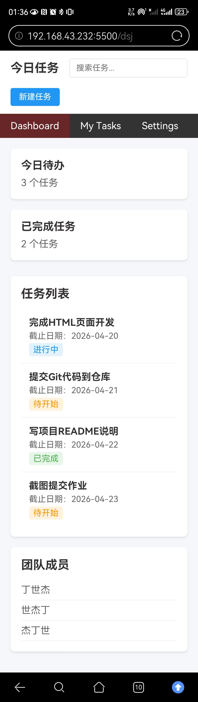

# 学生 README 模板

下面是一份可以直接修改的 README 模板，学生可以直接复制到自己的 `README.md` 中，再按实际情况修改。

# 项目名称

我的今日任务

## 项目简介

这是一个使用 HTML + CSS 完成的今日任务。

## 页面包含的内容

- 顶部区域
- 导航区域
- 数据卡片区
- 任务列表区
- 附加信息模块

## 我是怎么实现的

### HTML 结构

我把页面分成了这几个部分：

- header
- nav
- main
- section

### CSS 布局

我主要使用了：

- flex：用于导航栏、数据卡片、和任务列表的水平、垂直排列
- grid：用于数据卡片区的响应式布局，实现等宽卡片的自动排列，在大屏上实现多列布局，小屏上自动收缩为单列

### 响应式处理

当屏幕变小时，我做了这些调整：

- 导航栏改为垂直排列，搜索框占满宽度
- 数据卡片从水平排列改为垂直堆叠
- 调整了字体大小和边距，确保小屏幕上也能清晰阅读
- 使用 max-width 限制页面主体宽度

## 页面截图

### 桌面端

### 移动端

