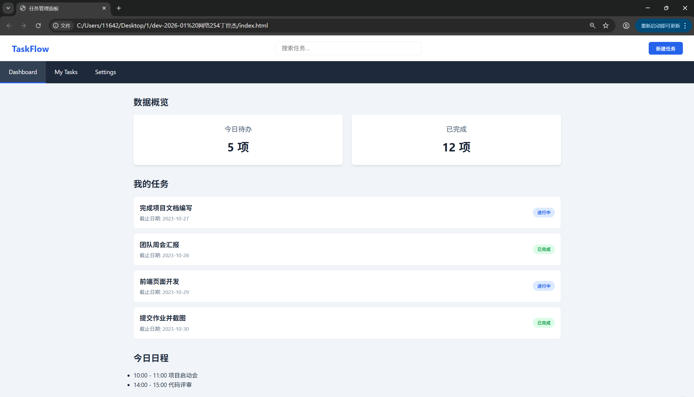
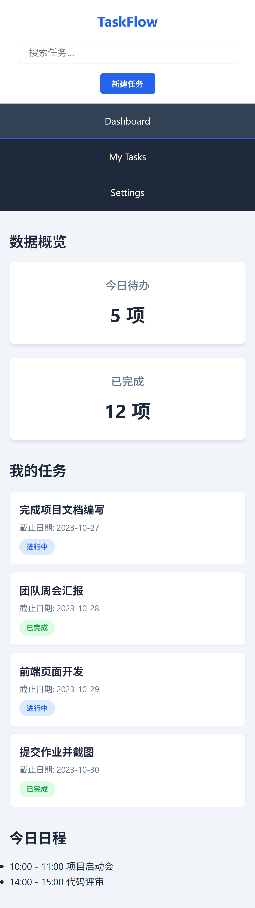

# 项目名称

我的今日任务

## 项目简介

这是一个使用 HTML + CSS 完成的任务管理页面，实现了包含顶部操作栏、导航菜单、数据卡片、任务列表及今日日程的完整后台界面，同时支持桌面端与移动端响应式展示。

## 页面包含的内容

- 顶部区域：页面标题、搜索框、新建任务按钮
- 导航区域：Dashboard、My Tasks、Settings 三个导航项，导航栏采用深色主题，任务卡片支持悬停动效，整体适配移动端浏览。
- 数据卡片区：今日待办、已完成任务统计卡片
- 任务列表区：展示任务名称、截止日期、任务状态
- 附加信息模块：今日日程记录

## 我是怎么实现的

### HTML 结构

我把页面分成了这几个部分：

- header：放置页面标题、搜索框和按钮
- nav：实现顶部导航菜单
- main：作为主内容容器
- section /article：分别包裹数据卡片、任务列表、今日日程模块
页面结构分为顶部区域、导航区域和主内容区，主内容区又细分为数据卡片区、任务列表区和附加信息模块，层次分明，便于维护。

### CSS 布局

我主要使用了：

- flex：用于顶部栏布局、导航项排列、任务项横向分布（内容与状态标签分离）以及移动端的垂直堆叠。
- grid：用于数据卡片的两列自适应布局

### 响应式处理

当屏幕变小时，我做了这些调整：

- 顶部区域自动换行，适配手机宽度
- 导航栏在小屏幕下改为垂直展示
- 数据卡片从 grid 两列变为单列堆叠
- 任务列表改为垂直排版，不出现内容溢出或错位
- 整体布局在移动端保持整洁、可读、可用

## 页面截图

### 桌面端

### 移动端

